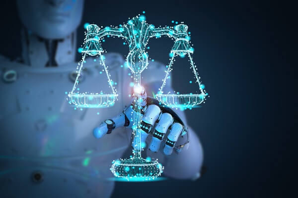
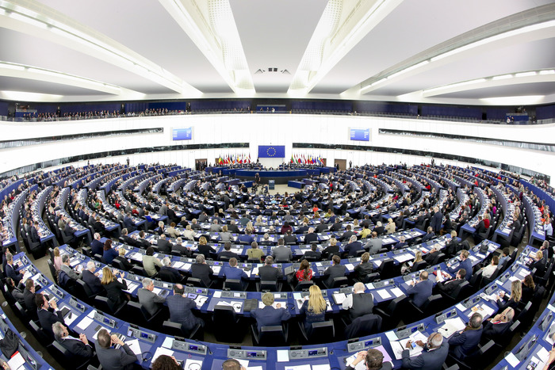

# Aspetti Giuridici

L’intelligenza artificiale rappresenta, potenzialmente, una grande opportunità per l’umanità: tale tecnologia è e sarà sempre più presente nella nostra vita quotidiana e, in un futuro non troppo remoto, diventerà, probabilmente, qualcosa con cui sarà normale convivere. Prima che questo accada, però, bisogna risolvere alcuni punti aperti, fondamentali per l’espansione su larga scala dell’IA.

Uno di questi è senza dubbio l’aspetto giuridico: un sistema di intelligenza artificiale, in quanto tale, non ha personalità giuridica, e non può quindi assumersi la responsabilità diretta di un atto da esso stesso provocato. Ciò non sarebbe un problema se tali sistemi svolgessero solamente azioni per cui sono stati programmati: in tal caso, nell’eventualità di danni causati da essi, la responsabilità ricadrebbe necessariamente sul produttore, sul programmatore o sull’utilizzatore, a seconda dei casi. Ma la realtà è ben diversa. Le macchine dotate di intelligenza artificiale sono, e saranno sempre di più, fornite di un sistema chiamato **Machine learning**, il quale, come approfonditamente analizzato nella sezione riguardante gli aspetti tecnici, si presenta come un “software di apprendimento” che permette loro di assimilare o migliorare talune performance, basandosi sui dati ottenuti e utilizzati. Come è facilmente constatabile, tale sistema porterà le macchine ad essere sempre più svincolate dalla programmazione umana, ad agire con crescente autonomia e, di conseguenza, ad avere una maggiore imprevedibilità.

Come risolvere questo problema?

Sono presenti diverse linee di pensiero: analizziamole separatamente.

# Intelligenza Artificiale Forte

Considerando il crescente grado indipendenza dei sistemi ad IA, il quale dà loro la possibilità di reagire a stimoli provenienti dall’esterno e di interagire con parti terze, la prima e più innovativa teoria si basa sulla convinzione che, nel XXI secolo, alle porte di una “quarta rivoluzione industriale”, sia necessaria anche una rivoluzione giuridica. I sostenitori di tale tesi (tra i quali è possibile annoverare **Alan Turing**), compresa nella corrente di pensiero dell’**Intelligenza Artificiale Forte,** ritengono che sia auspicabile riconoscere ai sistemi di intelligenza artificiale una propria soggettività. Tale decisione porterebbe i “soggetti” dotati di IA, oltre che ad avere una personalità legale, anche a diventare titolari di un’identità tramite un numero identificativo e, secondo alcuni, a ricevere il riconoscimento di un patrimonio proprio.

Ai possibili vantaggi di questa concezione, tra cui, soprattutto, la tutela e regolazione delle conseguenza legali delle sue azioni, si contrappongono però diversi problemi: in primis, non è assicurato che la tutela legale della vittima sia effettivamente migliorata dall’attribuzione di una personalità giuridica ad un automa, ad esempio in ambito di compensazione della vittima, la quale risulterebbe realmente garantita solo dalla copertura del robot da parte di un’**assicurazione**. Inoltre, riconoscendo loro una personalità giuridica, e diventando quindi soggetti di diritto, si rischierebbe la **deresponsabilizzazione** dei costruttori e degli utilizzatori.

# Intelligenza Artificiale Debole

La corrente di pensiero dell’**intelligenza artificiale debole** (tra i cui sostenitori ricordiamo il filosofo **John Searle**) ha una concezione più minimalista della questione. I fautori di tale corrente reputano che un calcolatore che abbia superato il **Test di Turing** non sia un vero e proprio **essere pensante**, ma soltanto uno strumento di controllo dei ragionamenti umani, in grado di simularli ma non di comprendere il significato degli atti che compie.

Per questo motivo, tale filosofia ritiene che non sia possibile travalicare il limite interposto tra esseri umani e calcolatori, attribuendo a questi ultimi la qualifica di soggetti. Secondo l’opinione di alcuni, pur mantenendo lo status di oggetto, sarebbe possibile creare un **regime legale speciale** adattabile a qualsiasi dispositivo dotato di intelligenza artificiale, assimilabile a quello attualmente applicato agli animali, che fungerebbe da modello al fine di crearne uno apposito per i calcolatori.

In tal caso, ad esempio, il proprietario o l’utilizzatore del dispositivo risulterebbe responsabile dei danni cagionati da esso nell’ipotesi di una perdita di controllo; al contempo, il dispositivo godrebbe di alcuni diritti, nel caso in cui esso dovesse subire attacchi alla sua integrità o danni provocati da soggetti terzi. In quanto meno radicale, l’adozione di un simile regime risulta perciò rilevante e degna di nota.

# Altre Possibili Soluzioni

Altre proposte, in via di sviluppo in Paesi come la **Corea del Sud** e gli **Stati Uniti**, comprendono l’introduzione di **carte dei diritti dei robot**: esse, oltre a concedere, appunto, diritti a tali dispositivi, hanno il principale scopo di definire il loro campo d’applicazione, arginandolo tramite limiti **etici**. Ciò ha lo scopo di evitare utilizzi deontologicamente scorretti dei dispositivi, ad esempio nel contesto dei **robot killer**. Tale provvedimento fa fede a quanto esposto da **Isaac Asimov** nelle celebri **leggi della robotica**, le quali asseriscono che un robot non deve metterne a rischio l’incolumità umana; al fine di evitare un uso deviato e distorto dei dispositivi contribuiscono, da una parte, le barriere fisiche e i sistemi di sicurezza e, dall’altra, i limiti derivanti da un chiaro quadro **etico** e **giuridico**. A tal proposito, **Ron Arkin**; professore della School of Computing al Georgia Institute of Technology, suggerisce l’introduzione di un “**agente morale artificiale”**, tramite l’introduzione nella macchina di una serie di regole che costituiscano una **pseudo-coscienza** della stessa, in modo da permettere la scelta della modalità d’azione in base, anche, a fattori di tipo etico.

# Le Proposte dell'Unione Europea

Considerando quanto appena esposto, appare chiaro che sia fondamentale definire un quadro normativo completo, che comprenda **principi etici** e **obblighi giuridici** relativi allo sviluppo, la diffusione e l’utilizzo dell’intelligenza artificiale, della robotica e delle tecnologie correlate, soprattutto di quelle ad alto rischio. Tutto ciò deve essere necessariamente basato sul diritto vigente nell’Unione Europea e sulla dichiarazione universale dei diritti umani e deve, da una parte, consentire l’introduzione, lo sviluppo e la diffusione di tecnologie innovative e, al contempo, garantire la protezione dei valori dell’Unione e dell’incolumità delle persone.

Per questo motivo, il 20 Ottobre 2020, il Parlamento Europeo ha approvato tre proposte in merito a **proprietà intellettuale**, **aspetti etici** e **responsabilità civile** nell’ambito di dispositivi dotati di IA.

## Responsabilità civile

In merito a ciò, il principio cardine attorno al quale ruota la proposta sta nell’equilibrio tra la garanzia del diritto di una persona che abbia subito **danno o pregiudizio** a richiedere un risarcimento dalla controparte di cui sia stata dimostrata la possibilità e l’incentivo a persone fisiche e giuridiche ad attivarsi sin dall’inizio per evitare di causare danni o pregiudizi avvalendosi di sistemi di IA.

Il Parlamento Europeo ritiene inoltre che ogni quadro giuridico in materia di responsabilità civile debba infondere fiducia nella sicurezza e nell’affidabilità di prodotti e servizi, compresa la tecnologia digitale: secondo esso occorre, dunque, trovare un punto di stabilità tra un’efficace e garantita tutela delle vittime ed una sufficiente libertà d’azione delle imprese produttrici e sviluppatrici di tali prodotti.

## Obbligo di assicurazione

Al fine di perseguire tali obiettivi, la proposta impone agli operatori, produttori ed utilizzatori di sistemi di IA di attivare un’apposita **polizza assicurativa** per la **responsabilità civile**, adeguata agli importi e all’entità del risarcimento, anch’essi stabiliti dal regolamento, il quale troverà applicazione, all’interno del territorio dell’Unione, laddove un’attività, un dispositivo o un processo virtuale o fisico guidato da un sistema di IA abbia arrecato un danno o un pregiudizio alla vita, alla salute, all’integrità fisica di una persona fisica, al patrimonio di una persona fisica o giuridica o abbia arrecato un danno immateriale rilevante risultante in una perdita economica verificabile. Inoltre, è presente una precisa differenziazione tra i sistemi di IA **ad alto rischio**, individuati da un apposito

elenco di definizioni, per i quali la responsabilità è oggettiva in caso di danni o pregiudizi arrecati, rispetto agli altri sistemi di IA dove la responsabilità assume il grado di colpa, sino a potere essere esclusa in caso di dimostrazione della non imputabilità in presenza di alcuni motivi individuati.

## Definizioni

La proposta contiene una serie di definizioni utili al fine di raggiungere gli obiettivi preposti, tra le quali:

1. **Sistema di intelligenza artificiale**:** esso è definito come un** sistema basato su un software o integrato in dispositivi hardware che mostra un comportamento che simula l’intelligenza, tra l’altro raccogliendo e trattando dati, analizzando e interpretando il proprio ambiente e intraprendendo azioni, con un certo grado di autonomia, per raggiungere obiettivi specifici. Tale sistema diviene “autonomo” quando è in grado di operare interpretando determinati dati forniti e utilizzando una serie di istruzioni predeterminate, senza essere limitato a tali istruzioni, nonostante il comportamento del sistema sia legato e volto al conseguimento dell’obiettivo impartito e ad altre scelte operate dallo sviluppatore in sede di progettazione.
1. **Sistema di intelligenza artificiale ad alto rischio**: in un apposito elenco, allegato al regolamento, sono individuati tali sistemi (come, ad esempio, gli aeromobili senza equipaggio, i veicoli con livelli di automazione, i sistemi autonomi di gestione del traffico e i robot autonomi) i quali sono contraddistinti da un potenziale significativo di causare danni o pregiudizi a una o più persone in modo casuale e che va oltre quanto ci si possa ragionevolmente aspettare. Un aspetto da rimarcare è la riconducibilità della responsabilità civile a tutti gli operatori, siano essi di **front-end**, ossia le persone fisiche o giuridiche che esercitano un certo grado di controllo su un rischio connesso all’operatività e al funzionamento del sistema di IA e che beneficiano del suo funzionamento, che di **back-end**, ovvero persone fisiche o giuridiche, le quali, su base continuativa, definiscono le caratteristiche della tecnologia e forniscono i dati e il servizio di supporto di back-end essenziale, esercitando perciò anche un elevato grado di controllo su un rischio connesso all’operatività e al funzionamento del sistema di IA. Gli operatori non sono invece considerati responsabili se risulta dimostrato che il danno o il pregiudizio sia stato dovuto a cause di forza maggiore. Quanto alla copertura assicurativa, l’operatore di front-end si assicura che le operazioni del sistema siano coperte da un’assicurazione a copertura della responsabilità civile adeguata agli importi e all’entità del risarcimento previsti. L’operatore di back-end si assicura invece che i suoi servizi siano coperti da un’assicurazione della responsabilità civile prodotti o imprese anch’essa adeguata agli importi e all’entità del risarcimento.

## Altri sistemi di IA

Un sistema di intelligenza artificiale che non sia considerato ad alto rischio, è soggetto a un regime di responsabilità per colpa in caso di eventuali danni o pregiudizi causati da un’attività, dispositivo o processo fisico o virtuale guidato dal sistema stesso. L’operatore non risulta responsabile qualora riesca a dimostrare che:

1. il sistema di IA si sia attivato senza che l’operatore ne fosse a conoscenza, nonostante fossero state adottate tutte le misure ragionevoli e necessarie per evitare tale attivazione al di fuori del controllo dell’operatore stesso;
1. sia stata rispettata la dovuta diligenza con lo svolgimento delle seguenti operazioni:
    - selezionamento di un sistema di IA idoneo al compito e alle competenze;
    - messa debitamente in funzione del sistema di IA;
    - monitoraggio delle attività;
    - mantenimento dell’affidabilità operativa mediante la periodica installazione di tutti gli aggiornamenti disponibili;

L’operatore non può svincolarsi dalla responsabilità sostenendo che il danno o il pregiudizio sia stato cagionato da un’attività, dispositivo o processo autonomo guidato dal suo sistema di IA ma, anche in questo caso, può farlo in caso dimostri che il danno sia stato dovuto a cause di forza maggiore.

Qualora il danno o il pregiudizio sia stato causato da un terzo che abbia interferito con il sistema di IA attraverso la modifica del suo funzionamento o dei suoi effetti, l’operatore è comunque tenuto a corrispondere un risarcimento se tale terzo non è rintracciabile o è insolvibile.

## Risarcimento

Un operatore di un sistema IA, che sia stato riconosciuto colpevole di danni o pregiudizi, è tenuto a risarcire:

1. fino a un importo massimo di due milioni di euro in caso di morte o danni alla salute o all’integrità fisica di una persona interessata in conseguenza della messa in funzione di un sistema di IA ad alto rischio;
1. fino a un importo massimo di un milione di euro in caso di danni immateriali rilevanti che risultino in una perdita economica verificabile o di danni al patrimonio in conseguenza di un’unica messa in funzione di un unico sistema di IA ad alto rischio.

## Prescrizione

Le azioni per responsabilità civile in merito a danni o pregiudizi alla **vita** o all’**incolumità fisica** sono soggette a un termine di prescrizione di 30 anni.

Le azioni per responsabilità civile in quanto a rilevanti danni al **patrimonio** o **immateriali** sono soggetti a un termine di prescrizione speciale di:

1. 30 anni, in caso di sistemi di IA ad alto rischio;
1. 10 anni, in tutti gli altri casi.

# La Nuova Proposta della Commisione Europea

Il 21 aprile 2021 la Commissione Europea ha pubblicato un’innovativa e ambiziosa proposta di **Regolamento sull’Intelligenza Artificiale**. Esso si focalizza principalmente su determinati utilizzi dei sistemi ad IA ad **alto rischio**. Anche in questo caso, l’obiettivo della proposta è duplice: innanzitutto, la tutela dei **diritti fondamentali** e dei **valori europei** e, in secondo luogo, la garanzia di una regolamentazione **adeguata** e **proporzionata**,** che non limiti lo sviluppo tecnologico, ma lo promuova, sviluppando fiducia in questa tecnologia e garantendo all’UE una posizione di **leadership tecnologica.\*\*

## Ambiti di applicazione

Il regolamento viene applicato all’immissione sul mercato, alla messa in servizio e all’uso di sistemi di IA, e divide gli usi in base al grado di **rischio**: basso, medio o elevato. Esso non è applicato ai sistemi di IA utilizzati esclusivamente a scopo **militare**; non si applica inoltre alle **autorità pubbliche** di Paesi terzi né alle **organizzazioni internazionali**, solo qualora esse non utilizzino sistemi di IA nell’ambito di programmi di cooperazione giudiziaria o investigativa con l’Ue o con uno Stato Membro.. In merito all’ambito di applicazione **territoriale**, il Regolamento si applica sia agli operatori europei, che ai fornitori o utenti di sistemi di IA stabiliti al di fuori dell’Ue, nel caso in cui l’“output” dei sistemi venga utilizzato all’intero dell’UE.

## Usi vietati dell’IA

Il Regolamento vieta in termini assoluti:

1. La vendita e l’uso di sistemi di IA che utilizzano tecniche **subliminali** per distorcere in maniera sostanziale il comportamento di una persona, potendo così causare, danni fisici o psichici a quella persona o ad altri;
1. La vendita e l’uso di sistemi di IA che sfruttano una **vulnerabilità** legata all’età o ad una disabilità di uno specifico gruppo di persone al fine di distorcere in maniera sostanziale il comportamento di una persona appartenente al gruppo, potendo in questo modo causare danni fisici o psicologici a quella persona o a terzi;
1. L’uso di sistemi di **credito sociale**, il quale è utilizzato per classificare la reputazione dei cittadini, da parte delle autorità pubbliche o da parte di chi agisce per conto delle stesse;
1. L’utilizzo in tempo reale di sistemi di **identificazione biometrica da remoto** (come i sistemi di riconoscimento facciale) in luoghi accessibili al pubblico per finalità di repressione dei reati. Il Regolamento però prevede svariate eccezioni a questo divieto e lascia in parte liberi gli Stati Membri di consentire e regolamentare l’uso di questo tipo di sistemi di IA.

## Regolamentazione dei sistemi di IA ad alto rischio

Il Regolamento qualifica come “sistemi di IA ad alto rischio” una serie di tecnologie che **creano rischi elevati per la salute, la sicurezza o i diritti fondamentali delle persone**, e ne prevede due principali categorie:

1. I sistemi destinati ad essere utilizzati come componenti di **sicurezza** di altri prodotti prodotti come, ad esempio, i dispositivi medici;
1. Una serie di sistemi di IA specificamente elencati in un allegato del Regolamento, che potrà essere integrato nel corso del tempo seguendo una seie di criteri fissati, tra cui i sistemi di IA da utilizzare per la selezione del personale, per valutare la solvibilità delle persone e i sistemi di polizia predittiva.

## Regole per sistemi ad alto rischio

Tra le regole presenti per tali sistemi, è possibile citare, in particolare:

- L’obbligo di creare e mantenere attivo un sistema di **risk management** (gestione del rischio);
- L’obbligo di assicurarsi che essi vengano sviluppati seguendo specifici criteri qualitativi per quanto riguarda i dati ed i modelli utilizzati, documentando in maniera adeguata come è avvenuto lo sviluppo di un determinato sistema di IA ed il funzionamento dello stesso;
- L’obbligo di assicurarsi che tali sistemi possano essere sottoposti a supervisione da parti di persone fisiche (**human oversight**);
- L’obbligo di garantire la loro **attendibilità**, **accuratezza** e **sicurezza**.

La verifica del rispetto dei requisiti di cui sopra avverrà attraverso **“procedure di valutazione della conformità”**, secondo modalità identiche o analoghe a quelle già previste per altri prodotti regolamentati a livello europeo. Questo sistema di **conformity assessment** sarà facilitato dall’adozione di appositi standard di riferimento da parte degli enti di normazione.

## Regulatory sandboxes

Il Regolamento introduce la possibilità di creare specifici **regulatory sandboxes**, ossia strumenti giuridici che permettono a determinate società di accedere ad un ambiente di sperimentazione al fine di verificare l’impatto del proprio prodotto sul mercato. Tale norma è stata introdotta allo scopo, come precedentemente detto, di incentivare lo **sviluppo tecnologico** e la fiducia nello stesso.

## Monitoraggio dei sistemi di IA

In merito agli aspetti istituzionali, il Regolamento prevede la fondazione di un **Comitato europeo per l’intelligenza artificiale**, ossia un organo con il compito specifico di sorvegliare la corretta **applicazione del Regolamento** nei vari Stati Membri e di elaborare **linee guida** in materia.

Inoltre, per quanto riguarda il monitoraggio successivo all’immissione in commercio, i fornitori sono tenuti ad implementare **sistemi volti a** **monitorare** l’utilizzo dei dispositivi che immettono sul mercato, per verificare se gli stessi rimangono **conformi al Regolamento** nel corso del proprio ciclo di vita. Sono inoltre tenuti a segnalare alle autorità competenti eventuali malfunzionamenti ed incidenti che dovessero riscontrarsi attraverso tale attività di monitoraggio.

## Sanzioni

Il Regolamento prevede che le **autorità competenti**, individuate da ciascuno Stato Membro, potranno prescrivere sanzioni amministrative fino a 30.000.000€ in caso di violazioni del Regolamento.

## Conclusioni

Il Regolamento risulta particolarmente innovativo ed ambizioso; tale carattere è riscontrabile nel fatto che la proposta dello stesso rappresenta il primo vero tentativo a **livello globale** di **regolamentare** in maniera **sistematica** l’utilizzo dell’Intelligenza Artificiale. Rimane ancora da vedere quali modifiche verranno apportate al regolamento nel corso dell’iter legislativo; ciò che è certo, però, è che in questo modo, l’Unione Europea si conferma come uno dei punti centrali in ambito di regolamentazione di nuove tecnologie digitali.

# Bibliografia

[www.difesadautore.it](http://www.difesadautore.it)  
[www.iusinitinere.it](http://www.iusinitinere.it)  
[www.agendadigitale.eu](http://www.agendadigitale.eu)  
