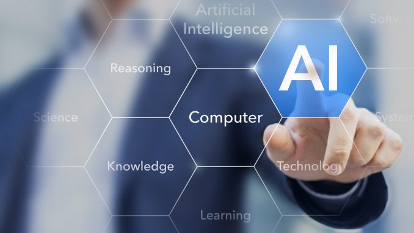
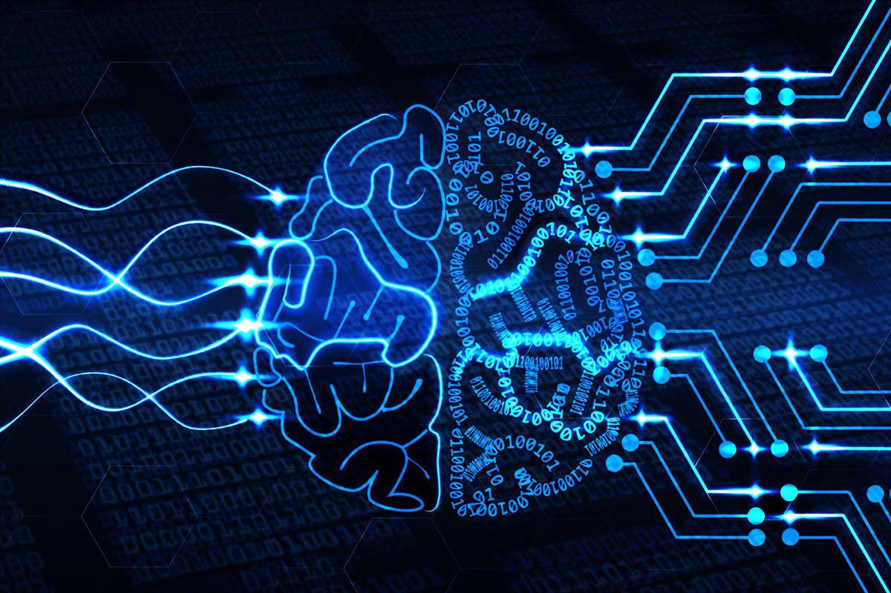
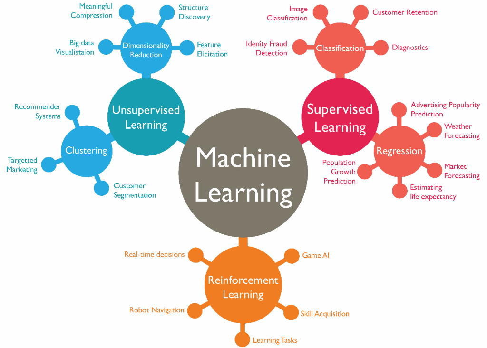
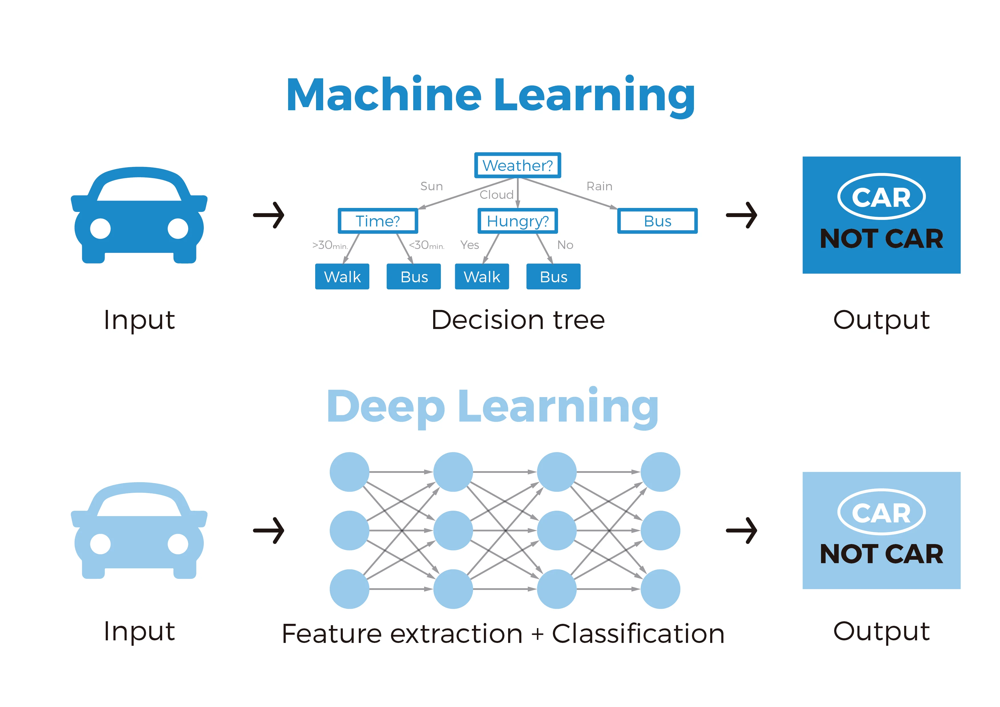
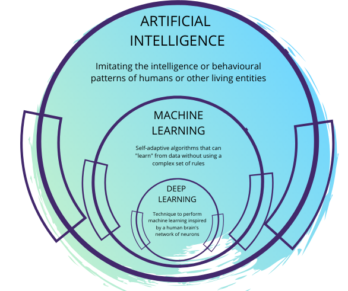
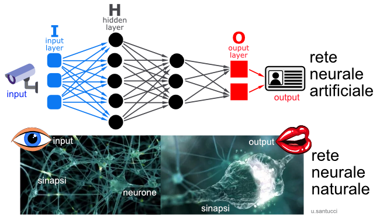

# Aspetti Tecnici

In termini tecnici, l’**Intelligenza Artificiale** è un ramo dell’informatica che permette la programmazione e progettazione di sistemi sia hardware che software che permettono di **dotare le macchine** di determinate **caratteristiche** che vengono considerate tipicamente umane quali, ad esempio, le **percezioni visive, spazio-temporali e decisionali**. Si tratta cioè, non solo di intelligenza intesa come capacità di calcolo o di conoscenza di dati astratti, ma anche e soprattutto di tutte quelle differenti forme di intelligenza che sono riconosciute dalla teoria di Gardner sulle intelligenze multiple, e che vanno **dall’intelligenza spaziale a quella sociale, da quella cinestetica a quella introspettiva**. Un sistema intelligente, infatti, viene realizzato cercando di ricreare una o più di queste differenti forme di intelligenza che, anche se spesso definite come semplicemente umane, in realtà possono essere ricondotte a particolari comportamenti riproducibili da alcune macchine.

L’uso delle **reti neurali** e di **algoritmi** in grado di riprodurre ragionamenti tipici degli esseri umani nelle differenti situazioni ha permesso ai sistemi intelligenti di migliorare sempre di più le diverse capacità di comportamento. Per poter realizzare ciò, la ricerca si è concentrata non solo sullo sviluppo di procedure sempre nuove, ma soprattutto su **algoritmi sempre più numerosi**, che potessero **imitare i diversi comportamenti a seconda degli stimoli ambientali**. Tali “procedimenti” complessi, inseriti all’interno di sistemi intelligenti, sono quindi in grado di ‘prendere decisioni’ ossia di **effettuare scelte** a seconda dei contesti in cui sono inseriti. Nel caso degli algoritmi connessi ai sistemi intelligenti dei veicoli, ad esempio, un’automobile senza conducente può decidere, in caso di pericolo, se sterzare o frenare a seconda della situazione, ossia a seconda che le informazioni inviate dai vari sensori permettano di calcolare una maggiore percentuale di sicurezza per il conducente e i passeggeri con una frenata o con una sterzata.

# Machine learning

Le decisioni di ogni tipo, sia quelle prese da un’auto senza pilota che da altri sistemi di Intelligenza Artificiale, sono prese, come già specificato, grazie alla realizzazione di determinati algoritmi, che permettono di **definire** una **conoscenza di base e** una **conoscenza allargata**, ossia **creata tramite l’esperienza**. Per realizzare algoritmi sempre più precisi e complessi, è sorta un vero e proprio settore specifico, definito **rappresentazione della conoscenza**, che studia tutte le possibilità di ragionamento dell’uomo e, soprattutto, tutte le possibilità di rendere tale conoscenza comprensibile alle macchine tramite un linguaggio e dei comandi sempre più precisi e dettagliati. Quando si parla di conoscenza dell’uomo e di trasferimento di tale conoscenza alla macchina, infatti, non si parla solo di conoscenza teorica, ossia di nozioni apprese dai libri o da altri strumenti di studio, ma piuttosto di esperienza e di possibilità di **comprendere nuove informazioni tramite quelle già presenti nel sistema di partenza**. Tali informazioni vengono fornite alla macchina tramite diverse modalità, le più importanti delle quali sono quelle che si basano sulla **Teoria dei Linguaggi Formali** e sulla **Teoria delle Decisioni**.

Nel primo caso, quando cioè si utilizza la **Teoria dei Linguaggi Formali**, si sceglie di utilizzare diversi approcci (quelli riconosciuti sono l’approccio generativo, riconoscitivo, denotazionale, algebrico e trasformazionale) che si rifanno alle **teorie delle Stringhe e ai loro utilizzi**. Le stringhe, infatti, rappresentano dei veri e propri linguaggi formali le cui proprietà variano proprio a seconda dell’approccio utilizzato. Si può quindi decidere di puntare su un approccio o sull’altro a seconda dei risultati che si intende ottenere, ossia a seconda del tipo di risposta che si vuole ottenere dalla macchina nelle differenti situazioni.

La **Teoria delle Decisioni**, invece, si basa su un **albero di decisione**, che permette di **valutare per ogni azione/decisione le possibili conseguenze** prendendo quindi poi la decisione più conveniente. A seconda delle impostazioni e dello scopo del programma, quindi, il sistema potrà prendere la decisione che meglio ottimizza il risultato che si vuole ottenere. Va sottolineato che situazioni simili possono prevedere risultati differenti a seconda del tipo di piano di azioni definito dagli algoritmi della macchina.

L’utilizzo della **Teoria delle Decisioni** e degli alberi di decisione merita un maggiore approfondimento, perché **maggiormente sfruttata** soprattutto in tutti quei sistemi intelligenti utilizzati nel quotidiano. Come funzione un albero di decisione? Senza entrare nel dettaglio, basta sapere che un **albero di decisione** **si basa su modelli predittivi a partire da una serie di informazioni iniziali e dati di partenza**. Tali dati possono poi essere suddivisi in maniera tale da **definire sia la struttura**, ossia il tipo di previsioni possibili, **sia l’accuratezza delle stesse**. Proprio l’accuratezza dei dati permette di ottenere dei sistemi intelligenti che si differenziano tra di loro per le risposte in grado di dare a seconda non tanto del numero di dati sul quale si basano le decisioni, ma a seconda della precisione degli stessi. Va sottolineato, inoltre, che la mole di dati a disposizione per le elaborazioni delle Intelligenze Artificiali può interferire con la precisione del modello utilizzato. Per questo motivo i modelli più accurati presentano un numero di informazioni di partenza spesso inferiore a quello che si può immaginare: **la bontà del modello viene comunque assicurata dal tipo di dati di partenza e dall’accuratezza degli stessi**.

Uno dei principali passi avanti nella storia dell’Intelligenza Artificiale è stata fatta quando si sono potuti ricreare degli algoritmi specifici, in grado di far **migliorare il comportamento della macchina** (inteso come capacità di agire e prendere decisioni) che può così **imparare tramite l’esperienza**, proprio come gli esseri umani. Sviluppare algoritmi in grado di imparare dai propri errori è fondamentale per realizzare sistemi intelligenti che operano in contesti per i quali i programmatori non possono a priori prevedere tutte le possibilità di sviluppo e i contesti in cui il sistema si trova a operare. Tramite **l’apprendimento automatico** (machine learning), quindi, una macchina è in grado di imparare a svolgere una determinata azione anche se tale azione non è mai stata programmata tra le azioni possibili.

Dietro questo particolare ramo dell’Intelligenza Artificiale vi è da sempre (e vi è ancora) una ricerca, sia teorica che pratica, basata, tra le tante cose, sulla teoria computazionale dell’apprendimento e sul riconoscimento dei pattern.

La complessità dell’apprendimento automatico ha portato a dover applicare **tre differenti strategie**, a seconda delle richieste di apprendimento che vengono fatte alla macchina. Si parla allora di **apprendimento supervisionato**, di **apprendimento non supervisionato** e di **apprendimento per rinforzo**. La differenza tra le tre modalità sta soprattutto nel differente contesto entro cui si deve muovere la macchina per **apprendere le regole generali** e particolari che lo portano alla conoscenza.

Nell’apprendimento supervisionato, in particolare, alla macchina vengono forniti degli **esempi di obiettivi da raggiungere**, mostrando le relazioni tra input, output, e risultato. Dall’insieme dei dati mostrati, la **macchina deve essere in grado di inferire una regola generale**, che possa permettere, ogni volta che venga stimolata con un determinato input, di scegliere l’output corretto per il raggiungimento dell’obiettivo.

Nel caso di apprendimento non supervisionato, invece, la **macchina dovrà essere in grado di effettuare scelte senza essere stato prima ‘educata’** alle differenti possibilità di output a seconda degli input selezionati. In questo caso, quindi, il computer non ha un maestro che gli permetta un apprendimento ma **impara esclusivamente dai propri errori**.

Infine, le macchine che vengono istruite tramite un apprendimento per rinforzo si trovano ad avere un’**interazione con un ambiente nel quale le caratteristiche sono variabili**. Si tratta, quindi, di un ambiente dinamico, all’interno del quale la macchina dovrà muoversi per portare a termine un obiettivo non avendo **nessun tipo di indicazione se non**, alla conclusione della prova, la **possibilità di sapere se è riuscita o meno a raggiungere lo scopo iniziale**.

L’apprendimento automatico è stato reso possibile dallo **sviluppo delle reti neurali artificiali**, ossia un particolare modello matematico che, ispirandosi ai neuroni e alle reti neurali umane, punta alla soluzione dei diversi problemi a seconda delle **possibilità di conoscere gli input e i risultati ottenuti a seconda delle scelte effettuate**. Il nome di rete neurale deriva dal fatto che questo modello matematico è caratterizzato da **una serie di interconnessioni** tra tutte le diverse informazioni necessarie per i diversi calcoli. Inoltre, proprio come le reti neurali biologiche, anche una rete neurale artificiale ha la caratteristica di essere **adattativa**, ossia di saper **variare la sua struttura adattandola alle specifiche necessità** derivanti dalle diverse informazioni ottenute nelle diverse fasi di apprendimento. Dal punto di vista matematico, una rete neurale può essere definita come **una funzione composta**, ossia dipendente da altre funzioni a loro volta definibili in maniera differente a seconda di ulteriori funzioni dalle quali esse dipendono.

# Deep learning

La traduzione strettamente letterale di questo termine, di chiara matrice anglosassone, è apprendimento approfondito. Ed è proprio questo il centro del suo significato, perché il deep learning, sottocategoria del Machine Learning, non fa altro che **creare modelli di apprendimento su più livelli**. Il concetto è molto semplice: immaginiamo di esporre una nozione; la apprendiamo e subito dopo ne esponiamo un’altra; il nostro cervello raccoglie l’input della prima e la elabora insieme alla seconda, trasformandola e astraendola sempre di più. Scientificamente, è corretto definire l’azione del deep learning come l’**apprendimento di dati** che **non sono forniti dall’uomo**, ma sono appresi grazie all’utilizzo di algoritmi di calcolo statistico. Questi algoritmi hanno uno scopo: comprendere il funzionamento del cervello umano e come riesca ad **interpretare le immagini e linguaggio**. L’apprendimento così realizzato ha la forma di una piramide: i **concetti più alti sono appresi a partire dai livelli più bassi**.

Il deep learning ha compiuto passi da gigante, ottenendo risultati che, fino a qualche decennio fa, erano pura utopia. Tale successo è dovuto alle numerose conquiste in campo informatico, relative soprattutto alla sfera dell’hardware. È importante portare il calcolatore a fare esperienza su un quantitativo sempre maggiore di dati e, fino a poco tempo fa, il tempo per ottenere tale addestramento era abbastanza elevato. Oggi, grazie all’introduzione delle GPUs, ovvero nuove unità che concorrono all’elaborazione dati, questo processo è diventato molto più snello. Un altro importante aiuto è derivato dalla facilità di trovare numerose collezioni di dati (dataset) fondamentali per allenare il sistema. Il deep learning fa una cosa fondamentale: ottiene come risultato la rappresentazione dei dati, ma lo fa a livello gerarchico e soprattutto a livelli diversi tra loro, riuscendo a elaborarli e a trasformarli. Questa trasformazione è stupefacente perché ci consente di assistere ad una macchina che riesce a **classificare i dati** in entrata (input) e quelli in uscita (output), evidenziando quelli **importanti ai fini della risoluzione del problema** e scartando quelli che non servono. La rivoluzione apportata dal deep learning è tutta nella capacità, simile a quella umana, di **elaborare i dati, le proprie conoscenze a livelli che non sono affatto lineari**. Grazie a questa facoltà, la macchina apprende e perfeziona funzionalità sempre più complesse.

Per comprendere il raggio d’azione del deep learning occorre chiarire un concetto fondamentale, ovvero quello relativo alle reti neurali. Immaginiamo un comando vocale. La stessa parola, ripetuta da persone diverse, può avere sfumature e inflessioni che cambiano in base all’individuo che la pronuncia. Come fa il PC a riconoscere il suono, a identificarlo? È ovvio che, da un punto di vista strettamente scientifico, un algoritmo sequenziale non può fornire il giusto supporto.

# Reti neurali

I circuiti neurali artificiali sono la **base di sofisticate forme di intelligenza artificiale**, sempre più evolute, in grado di apprendere sfruttando meccanismi simili (almeno in parte) a quelli dell’intelligenza umana. Risultato: prestazioni impossibili per altri algoritmi.

Il prototipo delle reti neurali artificiali sono quelle biologiche.

Le reti neurali del cervello umano sono la sede della nostra capacità di comprendere l’ambiente e i suoi mutamenti, e di fornire quindi risposte adattive calibrate sulle esigenze che si presentano.

Un singolo neurone di una rete neurale biologica può ricevere simultaneamente segnali da diverse sinapsi. Una sua capacità intrinseca è quella di misurare il potenziale elettrico di tali segnali in modo globale, stabilendo quindi se è stata raggiunta la soglia di attivazione per generare a sua volta un impulso nervoso. Tale proprietà è implementata anche nelle reti artificiali.

La configurazione sinaptica all’interno di ogni rete neurale biologica è dinamica. Si tratta di un fattore determinante per la loro efficienza. Il numero di sinapsi può incrementare o diminuire a seconda degli stimoli che riceve la rete. Più sono numerosi, maggiori connessioni sinaptiche vengono create, e viceversa. In questo modo, la risposta adattiva fornita dai circuiti neurali è più calibrata, e anche questa è una peculiarità implementata nelle reti neurali artificiali.

Nelle reti artificiali ovviamente **il processo di apprendimento automatico è semplificato rispetto a quello delle reti biologiche**. Non esistono analoghi dei neurotrasmettitori, ma lo schema di funzionamento è simile.

I nodi ricevono dati in input, li processano e sono in grado di inviare le informazioni ad altri neuroni. Attraverso cicli più o meno numerosi di input-elaborazione-output, in cui gli input presentano variabili differenti, diventano in grado di generalizzare e fornire **output corretti associati ad input non facenti parte del training set**.

Gli algoritmi di apprendimento utilizzati per istruire le reti neurali sono divisi in **tre categorie**. La scelta di quale usare **dipende dal campo di applicazione** per cui la rete è progettata e dalla sua tipologia (feedforward o feedback).

Gli algoritmi si rifanno ai classici algoritmi di machine learning precedentemente presentati e sono:

- supervisionato;
- non supervisionato;
- di rinforzo.

## Apprendimento Supervisionato

Nell’apprendimento supervisionato si fornisce alla rete un **insieme di input ai quali corrispondono output noti (training set)**. Analizzandoli, la rete apprende il nesso che li unisce. In tal modo impara a **generalizzare**, ossia a **calcolare nuove associazioni corrette input-output** processando input esterni al training set.

Man mano che la macchina elabora output, si procede a **correggerla** per migliorarne le risposte **variando i pesi attribuiti ai diversi fattori coinvolti nel processo decisionale**. Ovviamente, aumentano i pesi che determinano gli output corretti e diminuiscono quelli che generano valori non validi.

Il meccanismo di apprendimento supervisionato impiega l’[Error Back-Propagation](https://towardsdatascience.com/error-backpropagation-5394d33ff49b) (per i meno avvezzi all’inglese cliccare [qui](https://www.performancetrading.it/Documents/RetiNeuOpz/RNOEBP.htm) o [qui](https://netai.it/lalgoritmo-di-backpropagation-in-una-rete-neurale/#page-content)), ossia un sistema di **aggiornamento dinamico dei pesi** basato sui risultati ottenuti comparati ai risultati che si sarebbero dovuti ottenere.

La maggiore difficoltà si ha nel trovare un **rapporto adeguato** fra le dimensioni del training set, quelle della rete e l’abilità a generalizzare che si tenta di ottenere: un numero eccessivo di parametri in ingresso e una troppo potente capacità di elaborazione, paradossalmente, rendono difficile alla rete neurale imparare a generalizzare, perché gli input esterni al training set vengono valutati dalla rete come troppo dissimili ai sofisticati e dettagliati modelli che conosce; d’altro canto, un training set con variabili scarse porta per la via opposta alla stessa conclusione: la rete, in questo caso, non ha sufficienti parametri per apprendere a generalizzare. Il giusto compromesso, insomma, è un compito che necessita di molta preparazione ed esperienza.

Le reti feedforward come il MLP (MultiLayer Perceptron; vedere bibliografia per maggiori approfondimenti) utilizzano l’apprendimento supervisionato.

## Apprendimento non supervisionato

In una rete neurale ad apprendimento non supervisionato, la medesima riceve **solo un insieme di variabili di input**. Analizzandole, la rete deve creare dei **cluster rappresentativi** per **categorizzarle**. Anche in questo caso i valori dei pesi sono dinamici, ma sono i nodi stessi della rete a modificarli.

Esempi di reti ad apprendimento non supervisionato sono SOM (Self-Organizing Map) e la rete di Hopfield (Per maggiori approfondimenti sui temi consultare la bibliografia).

## Apprendimento per rinforzo

Nelle reti neurali che apprendono mediante l’algoritmo di rinforzo, non esistono né associazioni input-output di esempi, né un aggiustamento esplicito degli output da ottimizzare, ma i circuiti neurali imparano esclusivamente dall’**interazione con l’ambiente**.

Dato un risultato da ottenere, è considerato rinforzo l’**azione che avvicina al risultato**; la rete apprende quindi a **eliminare le azioni negative**, ossia foriere di errore. In altri termini, un algoritmo di apprendimento per rinforzo mira a indirizzare la rete neurale verso il risultato sperato con una **politica di incentivi** (azioni positive) **e disincentivi** (azioni negative).

Usando tale algoritmo, una macchina impara a trovare soluzioni che non è esagerato definire creative. Una rete neurale così implementata, per esempio, è stata utilizzata per giocare ad Arcade Breakout. Risultato: dopo sole quattro ore di continuo miglioramento, i circuiti hanno individuato una strategia di gioco mai ideata da un essere umano in questo videogame.

# Vantaggi delle reti neurali

L’utilizzo delle varie tipologie di reti neurali nasce dagli **importanti vantaggi** che presentano:

- **Elevato parallelismo**, grazie al quale possono processare in **tempi relativamente rapidi** grandi moli di dati;
- **Tolleranza ai guasti**, anche questo grazie all’architettura parallela;
- **Tolleranza al rumore**, ossia la capacità di operare, in molti casi, in modo corretto nonostante input imprecisi o incompleti;
- In alcune categorie di problemi costituiscono lo strumento migliore per gestire gli stessi: data mining, optimization, elaborazione di modelli predittivi e simulativi e classificazione sono i campi di impiego preferenziali per le reti neurali;
- **Evoluzione adattiva**: una rete neurale ben implementata è in grado di **auto-aggiornarsi** in presenza di modifiche ambientali.

# Limiti

Le reti neurali artificiali hanno comunque dei **limiti** ed è difficile prevedere se col tempo potranno essere eliminati o attenuati. Fra questi, i più importanti sono:

- Funzionamento a **black box**: un handicap rimarchevole delle reti neurali artificiali è il fatto che la loro computazione non è analizzabile in modo completo. Con questo si intende dire che sono in grado di fornire output corretti, o sufficientemente corretti, ma **non permettono di esaminare** i **singoli stadi** di elaborazione che li determinano;
- Non è possibile avere la certezza a priori che un problema sarà risolto;
- Gli output forniti **spesso non rappresentano la soluzione perfetta**, anche se in molti casi questo non è necessario;
- Il **periodo di learning è più o meno** lungo: le iterazioni necessarie dipendono da fattori quali numero e complessità delle variabili di input, algoritmo utilizzato, etc. In realtà, in tale ambito sono stati fatti importanti progressi ed è ragionevole ipotizzare che in futuro il periodo di learning potrà ulteriormente ridursi;
- Le reti neurali **non sono idonee a risolvere determinate categorie di problemi**. Un esempio è un tipo di input costituito da un numero elevato di variabili categoriche.

# Bibliografia

- [www.intelligenzaartificiale.it](http://www.intelligenzaartificiale.it)
- Maggiori approfondimenti sulla teoria dei linguaggi formali:
  - <https://it.wikipedia.org/wiki/Teoria_dei_linguaggi_formali>
- Maggiori approfondimenti sulla teoria delle decisioni:
  - <https://local.disia.unifi.it/chiandotto/STAT2_S/CAP%201%20-%20TEORIA%20delle%20DECISIONI.pdf>
- Maggiori approfondimenti sull’Error Back-Propagation:
  - <https://towardsdatascience.com/error-backpropagation-5394d33ff49b>
  - <https://www.performancetrading.it/Documents/RetiNeuOpz/RNOEBP.htm>
  - <https://netai.it/lalgoritmo-di-backpropagation-in-una-rete-neurale/#page-content>
- Maggiori approfondimenti sul MultiLayer Perceptron:
  - <https://en.wikipedia.org/wiki/Multilayer_perceptron>
  - <http://tesi.cab.unipd.it/40835/1/Modelli_di_reti_neurali.pdf>
- Maggiori approfondimenti sulle Self-Organizing Maps:
  - <http://www.pspc.unige.it/~drivsco/Papers/VanHulle_Springer.pdf>
  - <https://en.wikipedia.org/wiki/Self-organizing_map>
- Maggiori approfondimenti sulla rete di Hopfield:
  - <https://amslaurea.unibo.it/12038/1/Tesi_Silvia_Ferri.pdf>
  - <http://tesi.cab.unipd.it/63120/1/Costa_Filippo.pdf>
  - <https://it.wikipedia.org/wiki/Rete_di_Hopfield>
